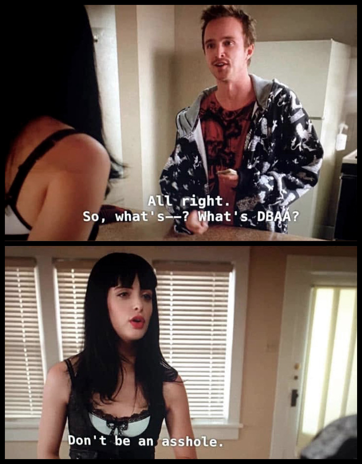

[Download latest release ⬇](https://github.com/zivanovicmarko-stack/OpenAI-Data-Exporter/releases/latest)

# OpenAI Data Exporter

### Export your ChatGPT conversations as clean, portable Markdown and PDF files, directly from an official OpenAI data export ZIP.

**Free to use, including commercially | Runs locally in your browser | No uploads | No account | No telemetry | Large images in PDF exports**

OpenAI Data Exporter converts an official OpenAI data export ZIP into separate Markdown and PDF files while preserving conversation structure, timestamps, attachments and available images. PDF exports retain selectable text and use large extracted images instead of small ChatGPT thumbnails when larger source images are available.

## 🗂️ File formats

Conversations can be exported as Markdown, PDF, or both. Markdown provides portable, searchable text with related files, while PDF provides a single-file document with selectable text, large images where available and clearly represented attachments.

Folder exports also include an `Assets` folder containing available original files extracted from the conversations, including images and other attachments found in the OpenAI Data Export ZIP file.

### 📄 Markdown

Each conversation is exported as a separate `.md` file with readable text, timestamps and conversation metadata. Related files are preserved alongside the Markdown files in folder exports.

Web-linked images remain as their original URLs in Markdown. Markdown export does not fetch or embed content from those URLs.

### 📕 PDF

Each conversation is exported as a separate `.pdf` file with selectable text, large images where available and clearly represented attachments. Images use the available page space instead of being reduced to small chat thumbnails.

Images referenced through web links are fetched and embedded when possible. Images that cannot be embedded remain represented as **Missing web image** entries with a clickable **Image link**.

## 🔒 Local processing

Your OpenAI export ZIP is processed directly in your browser and is not uploaded anywhere. The exporter has no backend, account system or telemetry.

Internet access is used only when generating PDFs that contain web-linked images. Ordinary links remain links and are not fetched as content. Markdown export does not fetch web-linked images.

## 📦 Large exports

Large OpenAI export archives are supported, including ZIP64 files and archives larger than 2 GB. Large exports can be processed directly without splitting them into smaller archives first.

## 🔎 Additional Content

OpenAI exports can omit AI-generated images and other content from the normal conversation data even when recoverable material still exists elsewhere inside the ZIP.

After the initial extraction, the exporter checks for traces of that content and can offer an optional deeper scan of the archive. The initial result always remains available, whether the additional scan is used or skipped.

## 📅 Dates and filenames

Chat creation and update dates can be added independently to exported filenames, making larger archives easier to organise and sort. The **creation date** represents when the conversation was created, while the **update date** is the timestamp of its last message.

Each date can independently be placed before or after the chat name.

`2025-09-02 - 2026-05-08 - Chat name.md`  
`Chat name - 2025-09-02 - 2026-05-08.md`

Message timestamps use `YYYY-MM-DD HH:MM:SS` in 24-hour format.

## 📑 How to use

The normal workflow is straightforward: load the OpenAI export, review the conversations found inside it, choose the required output and export the files. Additional recovery is offered only when potentially recoverable content is detected.

1. Drop or select your official OpenAI data export ZIP.
2. Select `Begin Extraction...`.
3. Search, sort and select the conversations you want.
4. Choose Markdown, PDF, or all available file types.
5. Save individual files or choose a folder for batch export.
6. If additional recoverable content is detected, optionally run the deeper scan.

Direct folder export requires browser support for local folder access, such as Chrome or Edge. Individual file saves use normal browser downloads.

<h2>⚙️ Technical details</h2>

This section covers processing, extraction and export behaviour in more detail, including information intentionally left out of the general overview.

### 🧮 Processing model

OpenAI Data Exporter is a standalone browser application. The source archive and extracted conversation data remain on the user's device throughout processing.

- No application backend receives conversation data.
- No account or login is required.
- No telemetry is collected.
- No upload stage is used.
- Ordinary web links remain links and are not fetched or embedded as content.
- External requests are made only while generating PDFs that contain web-linked images.

### 📦 ZIP handling

ZIP processing takes place directly in the browser rather than through a server-side extraction service.

- Standard ZIP and ZIP64 archives are supported.
- Archives larger than 2 GB are supported.
- No artificial archive-size cutoff is applied by the exporter.
- The source archive is read directly rather than uploaded for extraction.

### 💬 Conversation extraction

Conversations are reconstructed from the data available inside the official OpenAI export. Timing and naming information is preserved so the resulting files remain useful independently of the ChatGPT interface.

- Each exported message receives a timestamp in `YYYY-MM-DD HH:MM:SS`.
- Chat creation date is preserved where available.
- Chat update date is derived from the last message timestamp.
- Creation and update dates can be independently enabled for filenames.
- Each enabled date can be placed as a prefix or suffix.
- Extracted chats can be searched by name.
- Chats can be sorted by name or time before export.
- Chat selections remain active when the search filter changes.
- Selected folder export includes all selected chats, including selections that are not currently visible under the active search filter.

### 📄 Markdown output

Markdown exports remain normal readable text files and do not require a proprietary viewer.

Each exported conversation includes YAML metadata:

- `title:`
- `created:`
- `updated:`
- `exported:`
- `timezone:`
- `tags:`

Conversation content follows as regular Markdown with message timestamps and available attachment references. Folder exports preserve available related assets alongside the Markdown output.

Web-linked images are not fetched during Markdown export. Their original URLs are preserved directly in the conversation.

Each Markdown export ends with a single attribution line linking to OpenAI Data Exporter and its author.

### 📕 PDF output

PDF exports are generated as readable documents rather than screenshots of the ChatGPT interface. When a larger version of an image exists in the OpenAI export, that image is extracted and used instead of the small thumbnail shown in ChatGPT.

- Each conversation is written to a separate `.pdf` file.
- A4 portrait layout is used.
- Text remains selectable rather than being rasterised into page screenshots.
- Large extracted images are used instead of thumbnail-sized chat previews where available.
- Images preserve their aspect ratio and use the available printable page area.
- Large and tall images can occupy a full PDF page.
- For vertical images, if at least 60% of the usable page height remains, the image is placed on the current page and fitted to the available space.
- If less than 60% remains, the image moves to the next page and can use the full usable page area.
- Images that cannot fit correctly on the current page are moved forward rather than clipped.
- Non-image attachments use dedicated visual items with filename, type and size where available.
- A single attribution block appears at the end of the conversation rather than as a repeated page footer.

### 🌐 Web-linked images

Web-linked images are handled differently from ordinary links because PDF export attempts to retrieve the image itself and embed it in the document.

Markdown does not perform this retrieval. It preserves the original image URL as normal text.

When internet access is available, PDF export uses the following retrieval sequence:

- One initial retrieval attempt is made for each web-linked image.
- A failed retrieval is retried up to three times, with a one-second delay between attempts.
- A successful retrieval stops further attempts immediately.
- Retry handling is internal and does not appear in the exported conversation.
- Successfully retrieved images use the normal PDF image-layout rules.
- Failed retrieval preserves a clickable link to the original image URL rather than silently removing the reference.

When the exporter detects that there is no internet connection, the PDF shows:

**Missing web image**  
No internet connection. The image could not be fetched for PDF embedding.  
**Image link**

When the browser can display the image but browser security prevents the exporter from retrieving its data for PDF embedding, the PDF shows:

**Missing web image**  
Browser security prevents this image from being fetched for PDF embedding.  
**Image link**

For other retrieval failures where a specific cause cannot be established, the PDF uses the neutral fallback:

**Missing web image**  
The web image could not be fetched and embedded.  
**Image link**

`Image link` is a clickable hyperlink to the original image URL. The raw URL is not printed in the PDF.

Other external links remain normal links and are not fetched or embedded into the document.

### 🔎 Additional Content scan

Additional-content recovery is a separate optional stage performed only after the initial result already exists.

**Initial extraction** → **Potential additional content detected** → **Optional Additional Content scan** → **Updated / Unchanged**

- If no potentially recoverable content is detected, no additional-content prompt is shown.
- If content is detected, the user decides whether to continue.
- Skipping the deeper scan does not cancel or alter the initial result.
- A deeper scan can recover content that exists elsewhere inside the ZIP, but cannot reconstruct content absent from the source export.

### 🗂 Folder exports

Folder export writes multiple conversations directly to a location selected by the user.

- Files are written directly to the selected folder.
- No automatic timestamped export directories are created.
- Repeated exports overwrite files with the same generated filename in that folder.
- Additional recovered content updates existing exported files instead of creating duplicate versions.
- Cancelling a later folder-selection dialog does not clear the folder that was already selected.

### 📚 File type selection

Batch export can be limited to the required output types.

- **All File Types:** Markdown, PDF and available Assets.
- **MD Files Only:** Markdown and its available Assets.
- **PDF Files Only:** PDFs with selectable text and available images.

### 💾 Individual file saves

Individual conversation saves use normal browser download behaviour rather than direct folder writing.

- `Save MD` and `Save PDF` download the selected conversation through the browser.
- If no additional content needs attention, the selected file downloads normally.
- If potentially recoverable content is detected, the user can skip the optional scan and download the initial version.
- Continuing the scan downloads the updated individual file after processing is complete.

### 🌐 Browser folder access

Direct folder writing depends on browser support for local folder access, while individual files continue to use normal browser downloads.

- Direct folder export uses browser folder-access functionality.
- Folder writing is supported by browsers such as Chrome and Edge that expose the required capability.
- Individual Markdown and PDF saves use normal browser downloads.

### 📎 Attachments and assets

Attachments are preserved according to their type and the export format being generated.

- Attachments present in the OpenAI export are retained where possible.
- Markdown folder exports preserve available related assets in the exported folder structure.
- PDF exports represent non-image attachments as dedicated visual file items.
- Larger image files found in the export are used in PDFs instead of smaller chat thumbnails where available.

### 🔐 Privacy and network behaviour

Local processing applies to the OpenAI archive and the conversation data extracted from it. External access is used only when generating PDFs that contain web-linked images.

- The OpenAI export archive remains local.
- Extracted conversation data remains local.
- No backend receives the archive.
- No login is required.
- No telemetry is collected.
- There is no upload stage.
- Markdown export does not fetch web-linked images.
- PDF export makes external requests only for web-linked images referenced by the conversation.

### ⚠️ Known limitations

OpenAI Data Exporter can only work with data present in the source archive or web-linked images that the exporter is able to retrieve through the browser from their original URLs.

- OpenAI exports may omit AI-generated images and other elements.
- The Additional Content scan can recover material that exists elsewhere inside the archive, but cannot reconstruct data OpenAI never included.
- If only a smaller image exists in the source export, the exporter cannot recreate a larger version that is not present.
- Externally hosted images can disappear, move, reject access or otherwise become unavailable.
- Browser security can prevent an externally hosted image from being embedded even when the browser can display the image itself.
- Without an internet connection, externally hosted images cannot be retrieved for PDF embedding.
- Unavailable web images remain represented as **Missing web image** entries with their original **Image link** preserved.

## Licence

OpenAI Data Exporter is **free to use, including for commercial use**. It is licensed under the **Apache License 2.0 with the Commons Clause License Condition v1.0**.

You may use, modify and integrate the software subject to the licence terms. The Commons Clause restricts selling the software itself, or offering a product or service whose value derives entirely or substantially from its functionality.

OpenAI Data Exporter is therefore **source-available**, rather than OSI open source. See [LICENSE](LICENSE) for the complete legal terms.

Published under <strong>DBAA Licence</strong>

  
   
  <em>Scene from AMC's "Breaking Bad" series, created by Vince Gilligan. The image is the property of Sony Pictures Television.</em>

## Feedback and issues

Bug reports, edge cases and practical feedback are welcome. OpenAI may change the structure or contents of its data exports over time, so reports involving exports that behave differently from expected are particularly useful.

Please use the [Issues](https://github.com/zivanovicmarko-stack/OpenAI-Data-Exporter/issues) section and include enough information to reproduce the problem where possible. Redact private conversation content and other sensitive information. Include only the minimum information necessary to reproduce the issue.

## Screenshots

The gallery below shows the complete workflow from loading an OpenAI export to reviewing the resulting files. Each screenshot opens its full-resolution version.

<table width="100%" cellspacing="0" cellpadding="0" bgcolor="#0d1117">
  <tr>
    <td width="50%" valign="top" align="left" bgcolor="#0d1117">
      
    </td>
    <td width="50%" valign="top" align="left" bgcolor="#0d1117">
      
    </td>
  </tr>
  <tr>
    <td width="50%" height="70" valign="middle" align="center" bgcolor="#0d1117">
      
<strong>1. Load export</strong> Load or drop the official export ZIP.

    </td>
    <td width="50%" height="70" valign="middle" align="center" bgcolor="#0d1117">
      
<strong>2. Select export ZIP</strong> ZIP selected and ready to extract.

    </td>
  </tr>
  <tr>
    <td width="50%" valign="top" align="left" bgcolor="#0d1117">
      
    </td>
    <td width="50%" valign="top" align="left" bgcolor="#0d1117">
      
    </td>
  </tr>
  <tr>
    <td width="50%" height="70" valign="middle" align="center" bgcolor="#0d1117">
      
<strong>3. Extract chats</strong> Chats are extracted locally from the ZIP.

    </td>
    <td width="50%" height="70" valign="middle" align="center" bgcolor="#0d1117">
      
<strong>4. Review chats</strong> Search, sort and select extracted chats.

    </td>
  </tr>
  <tr>
    <td width="50%" valign="top" align="left" bgcolor="#0d1117">
      
    </td>
    <td width="50%" valign="top" align="left" bgcolor="#0d1117">
      
    </td>
  </tr>
  <tr>
    <td width="50%" height="70" valign="middle" align="center" bgcolor="#0d1117">
      
<strong>5. Choose export folder</strong> Choose where exported files are written.

    </td>
    <td width="50%" height="70" valign="middle" align="center" bgcolor="#0d1117">
      
<strong>6. Allow folder access</strong> Grant browser access to the export folder.

    </td>
  </tr>
  <tr>
    <td width="50%" valign="top" align="left" bgcolor="#0d1117">
      
    </td>
    <td width="50%" valign="top" align="left" bgcolor="#0d1117">
      
    </td>
  </tr>
  <tr>
    <td width="50%" height="70" valign="middle" align="center" bgcolor="#0d1117">
      
<strong>7. Choose file types</strong> Choose all files, MD only or PDF only.

    </td>
    <td width="50%" height="70" valign="middle" align="center" bgcolor="#0d1117">
      
<strong>8. Start bulk export</strong> Selected chats are written to the chosen folder.

    </td>
  </tr>
  <tr>
    <td width="50%" valign="top" align="left" bgcolor="#0d1117">
      
    </td>
    <td width="50%" valign="top" align="left" bgcolor="#0d1117">
      
    </td>
  </tr>
  <tr>
    <td width="50%" height="70" valign="middle" align="center" bgcolor="#0d1117">
      
<strong>9. Folder control disabled</strong> Folder selection is unavailable during bulk export.

    </td>
    <td width="50%" height="70" valign="middle" align="center" bgcolor="#0d1117">
      
<strong>10. Single-file saves disabled</strong> Save MD and Save PDF are unavailable during bulk export.

    </td>
  </tr>
  <tr>
    <td width="50%" valign="top" align="left" bgcolor="#0d1117">
      
    </td>
    <td width="50%" valign="top" align="left" bgcolor="#0d1117">
      
    </td>
  </tr>
  <tr>
    <td width="50%" height="70" valign="middle" align="center" bgcolor="#0d1117">
      
<strong>11. Reset disabled</strong> Only Cancel remains available during bulk export.

    </td>
    <td width="50%" height="70" valign="middle" align="center" bgcolor="#0d1117">
      
<strong>12. Additional Content</strong> Potentially recoverable content was found.

    </td>
  </tr>
  <tr>
    <td width="50%" valign="top" align="left" bgcolor="#0d1117">
      
    </td>
    <td width="50%" valign="top" align="left" bgcolor="#0d1117">
      
    </td>
  </tr>
  <tr>
    <td width="50%" height="70" valign="middle" align="center" bgcolor="#0d1117">
      
<strong>13. Working...</strong> Additional Content is processed for selected exports.

    </td>
    <td width="50%" height="70" valign="middle" align="center" bgcolor="#0d1117">
      
<strong>14. Finished</strong> Updated exported files are listed.

    </td>
  </tr>
  <tr>
    <td width="50%" valign="top" align="left" bgcolor="#0d1117">
      
    </td>
    <td width="50%" valign="top" align="left" bgcolor="#0d1117">
      
    </td>
  </tr>
  <tr>
    <td width="50%" height="70" valign="middle" align="center" bgcolor="#0d1117">
      
<strong>15. Return to exporter</strong> Close the result and continue working.

    </td>
    <td width="50%" height="70" valign="middle" align="center" bgcolor="#0d1117">
      
<strong>16. Exported files</strong> Review exported Markdown, PDF and Assets.

    </td>
  </tr>
</table>
